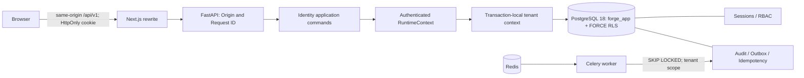

# Bootstrap runtime boundaries

Identity resolution has two narrow privileged database functions before tenant context exists. Direct SQL through forge_app remains subject to RLS; see ADR 0005. The same transaction commits session mutation, audit, outbox and idempotency response. No call to celery.delay() is used as a substitute for a committed outbox event.

Browser state: TanStack Query for authenticated profile; React Hook Form + Zod for the login form; local component state for navigation dialog. No persistent browser credential storage, no duplicate hand-written API DTOs. Protected views show loading until /auth/me succeeds; this client routing is UX only—server authentication and permission checks enforce access.

Bootstrap permission vocabulary contains profile.read and system.read only. ADMIN seed binds existing platform permissions. Future business permissions, RBAC administration UI, product entities and all ERP operations are deferred. Organization is the tenancy root; Permission is global platform metadata. Every other table is tenant owned.

API endpoint inventory:

| Endpoint | Purpose | Authentication |
|---|---|---|
| GET /healthz | Process liveness | Public |
| GET /readyz | PostgreSQL schema and Redis availability | Public |
| GET /api/v1/system/version | Non-sensitive build metadata | Public |
| POST /api/v1/auth/login | Establish opaque session | Credentials + Origin + Idempotency-Key |
| POST /api/v1/auth/logout | Revoke current session | Origin; repeat is a no-op |
| GET /api/v1/auth/me | User, organization and permissions | Active session + profile.read |
